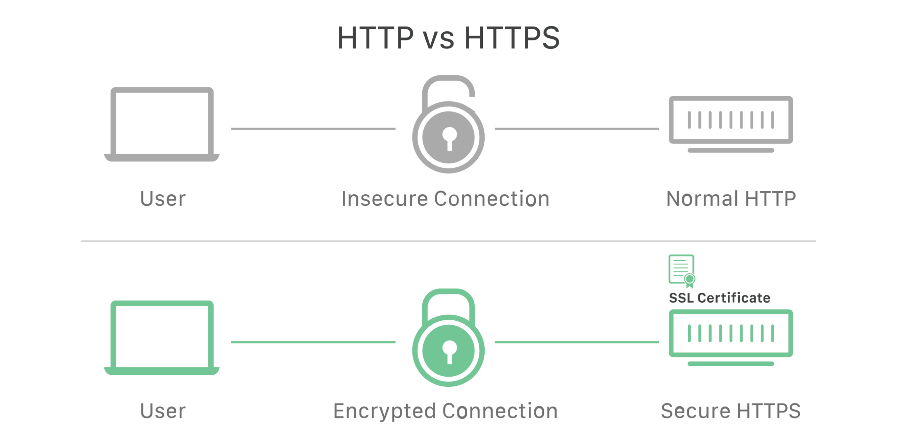

# HTTP, HTTPS

## 💡 HTTP와 HTTPS의 차이점에 대해 설명하세요.

_사진 출처: [Cloudflare](https://www.cloudflare.com/ko-kr/learning/ssl/why-is-http-not-secure/)_

HTTP는 서버와 클라이언트 간에 데이터를 주고받기 위한 애플리케이션 레벨의 프로토콜로 TCP/IP 위에서 동작합니다.
HTTPS는 HTTP 프로토콜에 TLS 암호화를 추가한 것입니다.
암호화 이외에도 데이터를 보호하기 위해 인증서를 사용하여 신뢰할 수 있는 서버인지를 확인합니다.
HTTPS를 사용하면 데이터 보호가 강화되어서 비교적 안전하게 데이터를 주고받을 수 있습니다.

## 💡 HTTPS는 어떻게 동작하나요?

HTTPS는 연결 과정에서 서버와 클라이언트 간에 세션키를 교환합니다. 세션키는 주고받는 데이터를 암호화할 때 사용하는 대칭키입니다. 서버와 클라이언트가 세션키를 교환할 때는 비대칭키를 사용합니다. 처음 연결을 성립하여 안전하게 세션키를 공유하는 과정에서 비대칭키를 사용하고 이후 데이터를 교환하는 과정에서 빠른 연산 속도를 위해 대칭키를 사용합니다.

## 📚 추가 참고 내용

:::info

HTTP는 비연결적인 특징이 있어서 연결이 끊어지면 이전에 주고받았던 모든 정보를 잊어버립니다. 이렇게 HTTP 프로토콜 자체는 상태를 유지하지 않는 특징을 가지고 있습니다. 이러한 특징의 장점은 다음 요청이 올 때까지 연결을 유지할 필요가 없어서 서버의 부담을 줄일 수 있다는 점입니다. 반대로 단점은 사용자의 상태를 유지할 수 없다는 것입니다. 따라서 로그인 상태 유지와 같은 개인화된 사용자 경험을 제공하기 위해서는 쿠키나 세션을 활용하는 것이 필요합니다.

:::
